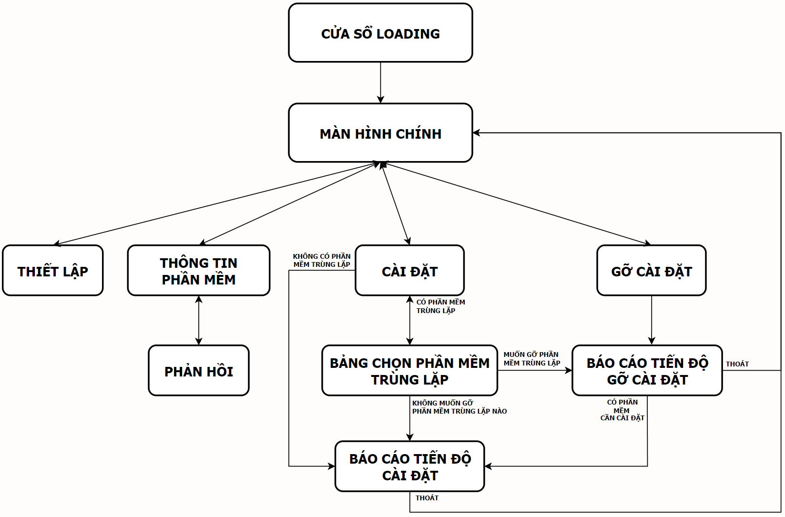

# # IT008.M11 - VISUAL PROGRAMMING 
**© 2021 University of Information Technology / autoStudent Project**
------------
###  **1. THÀNH VIÊN THAM GIA**

  
Thông tin chi tiết các thành viên

| STT | MSSV | HỌ VÀ TÊN | LỚP | VAI TRÒ |
| --- | --- | --- | --- | --- |
| 1 | 20521008 | [Phan Xuân Quang](https://github.com/phanxuanquang "Phan Xuân Quang") | KTPM2020 | Trưởng nhóm |
| 2 | 20521956 | [Trần Văn Thiệt](https://github.com/MiMi-Yup "Trần Văn Thiệt") | KTPM2020 | Thành viên |
| 3 | 20521768 | [Nguyễn Hoàng Phúc](https://github.com/phucnh20521768 "Nguyễn Hoàng Phúc") | KTPM2020 | Thành viên |
| 4 | 20521205 | [Dín Hiền Dũng](https://github.com/dung-ovl "Dín Hiền Dũng") | KTPM2020 | Thành viên |

###  **2. TỔNG QUAN**

  
Bài toán thực tế

Trong thực tế đời sống và công việc, chúng ta thường sẽ gặp các tình huống sau:

- *Trường đại học muốn tự thiết lập hệ thống các phần mềm cần thiết trong máy tính Windows của các sinh viên.*
- *Sinh viên không hiểu biết nhiều về công nghệ thông tin hoặc sinh viên năm nhất cần xây dựng tập hợp phần mềm cần thiết cho chương trình học một cách tiện lợi nhất.*
- *Người dùng muốn cài một tập hợp nhiều phần mềm một cách nhanh nhất.*
- *Một tổ chức muốn tiết kiệm thời gian và nhân lực cho việc thiết lập hệ thống phần mềm trong máy tính Windows của toàn bộ nhân viên hoặc chỉ đơn giản là muốn cài thêm một số lượng phần mềm cho máy tính của các nhân viên mà không muốn phải ghost Windows hay để nhân viên tự cài đặt.*
- . . .

  
Mục tiêu ứng dụng

- Rút ngắn thời gian người dùng cài đặt và gỡ cài đặt ứng dụng.
- Chọn lọc những phần mềm có thể hỗ trợ (hơn 150 phần mềm).
- Tự động hóa quá trình cài đặt và gỡ cài đặt.
- Chia sẻ những phần mềm cho nhiều người khác.
- Các tiện tích như hẹn giờ, chạy ngầm, .v.v

### **3. YÊU CẦU CHỨC NĂNG CHI TIẾT**

  
Hẹn giờ, chạy ngầm, khởi động cùng Windows

- Đặt timeout.
- Đặt registry trong hệ thống.
- Notify để chạy ngầm.

  
Dọn dẹp, cập nhật, phản hồi

- Xóa thư mục dùng để lưu những trình cài đặt sẽ tải về, thư mục tạm thời
- Kiểm tra thời điểm gói tin được sửa đổi lần cuối cùng, nếu thay đổi thì cập nhật cơ sở dữ liệu.
- Gửi phản hồi qua gmail cho nhà phát triền.

  
Chọn phần mềm

- Hiển thị danh sách phần mềm hỗ trợ trên cơ sở dữ liệu.
- Hiển thị danh sách phần mềm trong máy tính.
- Lọc những phần mềm trong từng ngành (kỹ thuật, công nghệ thông tin, đa phương tiện, .v.v).
- Đưa danh sách phần mềm từ bên ngoài bằng tệp tin *.as

  
Cài đặt

- Hiển thị danh sách các phần mềm sẽ cài đặt.
- Hiển thị trạng thái của từng phần mềm và tổng thể.
- Hủy một phần mềm hoặc hủy toàn bộ (hủy phần mềm đang tải, phần mềm chưa tới lượt)
- Cho phép chạy ngầm khi chưa hoàn thành tất cả.

  
Gỡ cài đặt

- Hiển thị danh sách các phần mềm sẽ gỡ cài đặt.
- Hiển thị trạng thái tổng thể.
- Hủy một phần mềm hoặc hủy toàn bộ (phần mềm chưa tới lượt)
- Cho phép chạy ngầm khi chưa hoàn thành tất cả.

  
Mã hóa dữ liệu

- Sử dụng AES-256bit mã hóa cơ sở dữ liệu, tập tin nhập xuất, lịch sử thiết lập, .v.v

  
Tải trình cài đặt

- Trích xuất cơ sở dữ liệu, lấy link để tải tập tin cài đặt.
- Kiểm tra tính chính xác của tập tin tải về.

### **4. SƠ ĐỒ KHỐI**

  
Sơ đồ giao diện phần mềm

|             |
| :-----------------------------------------: |
| _SƠ ĐỒ ĐƯỜNG ĐI_ |

### **5. CÔNG NGHỆ SỬ DỤNG**

  
Các công nghệ sử dụng

- Ngôn ngữ lập trình: C#
- Nền tảng: .Net Framework, version 4.7.2
- Thư viện đồ họa: Windows Forms, GunaUI
- Môi trường phát triển: Microsoft Visual Studio 2019
- Thư viện hỗ trợ khác: Newtonsoft.Json, Microsoft.WindowsAPICodePack

### **6. YÊU CẦU HỆ THỐNG**

| No. |  | Tối thiểu | Khuyến nghị |
| --- | --- | --- | --- |
| 1 | Hệ điều hành | Windows 7 32-bit | Windows 10 64-bit trở lên |
| 2 | RAM | 2 GB | 4 GB trở lên |
| 3 | Dung lượng trống trong ổ cứng | 100MB | 100MB | 
| 5 | Kết nối mạng | Chỉ cần cho tác vụ cài đặt | Chỉ cần cho tác vụ cài đặt |

### **7. CÁC CHỨC NĂNG CHÍNH - HƯỚNG DẪN CÀI ĐẶT**
[Hướng dẫn sử dụng](./ReadmeAsset/manual.pdf)